## Extending WooCommerce to show sales by country using JavaScript and React 

With the [release of WooCommerce 4.0](https://woocommerce.wordpress.com/2020/03/10/woocommerce-4-0-is-here/) that now includes the [WooCommerce Admin](https://wordpress.org/plugins/woocommerce-admin/) plugin, extension developers can take advantage of a **new WooCommerce extensibility model based on JavaScript and React**. You can use this new model when you modify existing or create new analytics reports, add new widgets to the new WooCommerce dashboard, or hook into WooCommerce breadcrumbs navigation.

If you've missed prior talk about this new JavaScript-focused experience that has evolved as part of WooCommerce Admin, here are some helpful links:
* [Alpha-Test The New Javascript-driven WooCommerce Interface: Dashboard, Activity Panel, and Reports](https://woocommerce.wordpress.com/2018/10/18/wc-admin/)
* [Extending WC-Admin Reports](https://woocommerce.wordpress.com/2020/02/20/extending-wc-admin-reports/)
* [Integrating The New WooCommerce Navigation Bar](https://woocommerce.wordpress.com/2020/02/27/integrating-the-new-woocommerce-navigation-bar/)
* [WooCommerce Admin Components](https://woocommerce.github.io/woocommerce-admin/#/components/)

In this tutorial, we'll take a closer look at this new extensibility model. We're going to walk through the process of creating a **fully functional WooCommerce extension** that displays an independent analytics report, gets data from **WooCommerce REST API**, processes the data using JavaScript, gets a native look and feel by using a set of WooCommerce's own **library of React components**, integrates a **third-party component** when native components aren't enough, and gets by with only 60 lines of PHP code, of which 35 are generated.

By the end of the tutorial, the resulting extension should look like this:

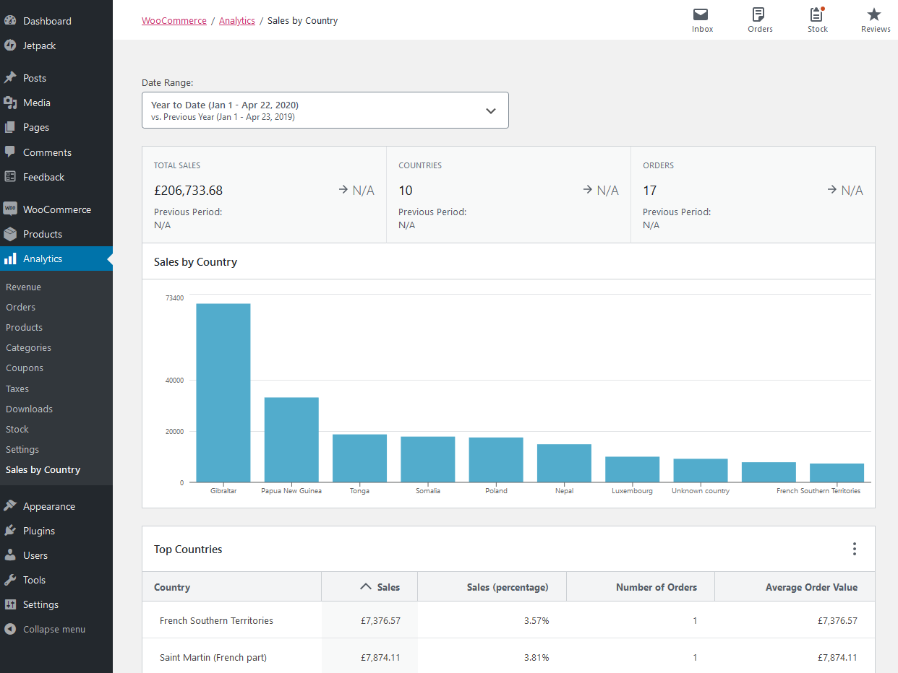

- [What we're going to do](#what-were-going-to-do)
- [What you'll need](#what-youll-need)
- [Preparing to get started](#preparing-to-get-started)
- [Creating a standalone report](#creating-a-standalone-report)
  * [Scaffolding with the starter pack](#scaffolding-with-the-starter-pack)
  * [Making the extension discoverable via WordPress admin sidebar](#making-the-extension-discoverable-via-wordpress-admin-sidebar)
  * [Integrating the extension into WooCommerce's own breadcrumbs navigation](#integrating-the-extension-into-woocommerces-own-breadcrumbs-navigation)
- [Exploring available React components](#exploring-available-react-components)
- [Extracting the extension's main React component to a separate file](#extracting-the-extensions-main-react-component-to-a-separate-file)
- [Adding mock data while live data isn't available](#adding-mock-data-while-live-data-isnt-available)
- [Adding a date range selector](#adding-a-date-range-selector)
  * [The groundwork](#the-groundwork)
  * [The actual date range selector](#the-actual-date-range-selector)
- [Adding a report summary](#adding-a-report-summary)
- [Adding a table view](#adding-a-table-view)
  * [Creating a custom component to prepare table data](#creating-a-custom-component-to-prepare-table-data)
  * [Making the table view sortable](#making-the-table-view-sortable)
    + [Applying the default sort order](#applying-the-default-sort-order)
    + [Enabling changes to sort column and order](#enabling-changes-to-sort-column-and-order)
- [Fetching real data](#fetching-real-data)
- [Updating data when a new date range is selected](#updating-data-when-a-new-date-range-is-selected)
- [Adding native placeholder components to display while data is loading](#adding-native-placeholder-components-to-display-while-data-is-loading)
- [Adding a chart component to visualize per-country data](#adding-a-chart-component-to-visualize-per-country-data)
  * [Integrating a third-party bar chart component](#integrating-a-third-party-bar-chart-component)
  * [Adding a custom tooltip](#adding-a-custom-tooltip)
  * [Styling the bar chart](#styling-the-bar-chart)
- [Finishing touches](#finishing-touches)
- [That's it!](#thats-it)

### What we're going to do

To illustrate the new extensibility model driven by WooCommerce Admin, let's take an existing WooCommerce extension that makes heavy use of data visualization, and see how we can create something similar using JavaScript and React.

The extension that we're going to take inspiration from is [Sales Report By Country for WooCommerce](https://www.zorem.com/products/woocommerce-sales-report-by-country/). The extension adds a new report tab that breaks down sales by country. It's available in WooCommerce's legacy *Reports* view (*WP-Admin | WooCommerce | Reports*), and looks like this:

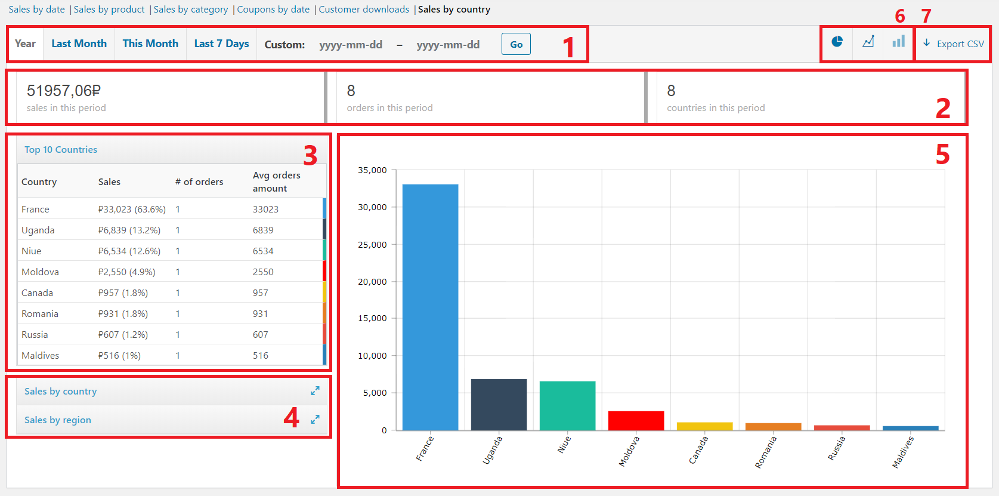

Let's break the extension down to individual components. It provides:
* A date range selector.
* An area to display total sales, orders and countries for a selected date range.
* A leaderboard-style table representing top 10 countries where orders from a selected date range are coming from.
* Country and region selectors that help focus on one or more countries or regions. Each of the selectors accepts multiple filters.
* A chart area to visualize data based on selected filters.
* Chart type controls. By default, a bar chart is used for visualization, but you can opt to use a line chart or a pie chart instead.
* Export to CSV.

We will not necessarily try to implement all of these features, but we'll see how far we can go.

### What you'll need

* A local WordPress 5.3+ installation.
* WooCommerce 4.0 or later.
* Git.
* Node.js 12.0.0+. (Your installation will need to bundle npm 6.9 or later, which corresponds to Node.js 12.0.0 or later.)

### Preparing to get started

Although WooCommerce Admin is now bundled with WooCommerce, it's still maintained as a plugin with a separate code base. This is what you'll need to use for the best development experience.

1. Clone the [*wc-admin* repo](https://github.com/woocommerce/woocommerce-admin) to your local WordPress installation's *wp-content/plugins* directory.

2. In the root of the cloned repo (`{your_WordPress_installation}/wp-content/plugins/woocommerce-admin/`), run `npm install` to obtain JavaScript dependencies that WooCommerce Admin requires.

3. In the root of the cloned repo, run `composer install` to obtain PHP dependencies.

### Creating a standalone report

#### Scaffolding with the starter pack

WooCommerce Admin provides something called a "starter pack" &mdash; a way to generate code that will serve as a starting point for developing a new extension. Among other files, the starter pack contains entry points for PHP and JavaScript parts of our new extension, `package.json` with default dependencies and available scripts, and `webpack.config.js` that defines JavaScript and Scss build processes using [Webpack](https://webpack.js.org/).
  
Here's how to generate boilerplate code for a new extension using the starter pack:

1. While still in the root of the cloned WooCommerce Admin repo, run `npm run create-wc-extension` to start scaffolding an extension template. When asked to specify a name for the extension, enter `sample-sales-by-country`. As a result, the new extension will be scaffolded in a new subdirectory under your WordPress installation's `/wp-content/plugins/` directory:
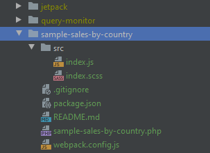

2. Go to the root directory of the extension that the starter pack has generated. Once there, run `npm install` to obtain JavaScript dependencies defined in the extension's `package.json` file.

3. Once dependencies are installed, run `npm start`. As a result, Webpack will spawn a development server and start watching for changes in JavaScript code to compile them on-the-fly.

4. In our extension's `.php` file, rename the registration function to make sure it has a unique name (such as `add_sample_sales_by_country_register_script`), and update the second argument in the `add_action()` call accordingly:
    ```php
    function add_sample_sales_by_country_register_script() {
    ...
    }
    
    add_action( 'admin_enqueue_scripts', 'add_sample_sales_by_country_register_script' );
    ```

5. Go to the admin area of your local WordPress installation, locate the new extension under *Plugins | Install Plugins*, and activate it.

#### Making the extension discoverable via WordPress admin sidebar

Our extension is now live but it doesn't do anything. Let's start by making it discoverable in the section of WordPress Admin that WooCommerce uses.

First, let's add a link to the extension's page to WordPress Admin's sidebar. All WooCommerce reports powered by WooCommerce Admin are available under the *Analytics* group, so we'll add our extension there as well. To do this, we'll need to hook into a backend filter called `woocommerce_analytics_report_menu_items`.

1. Open our extension's main PHP file, `sample-sales-by-country.php`.

2. Add the following code to the end of the file:

    ```php
    add_filter('woocommerce_analytics_report_menu_items', 'add_sample_sales_by_country_to_analytics_menu');
    
    function add_sample_sales_by_country_to_analytics_menu($report_pages) {
        $report_pages[] = array(
            'id' => 'sample-sales-by-country',
            'title' => __('Sales by Country', 'sample-sales-by-country'),
            'parent' => 'woocommerce-analytics',
            'path' => '/analytics/sample-sales-by-country',
        );
    
        return $report_pages;
    }
    ```

This will add our extension's page to the [list of pages](https://github.com/woocommerce/woocommerce-admin/blob/fe7b6cca7a095d1a39043bd1b38fc055cf0b121d/src/Features/Analytics.php#L77) that WooCommerce Admin's `Analytics` class registers with WordPress to show under its *Analytics* page group in the sidebar. Once you refresh the admin view of your local WordPress installation, you should be able to see our extension, "Sales by Country", listed in the sidebar under *Analytics*:

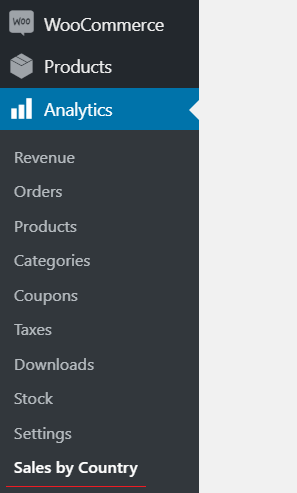

#### Integrating the extension into WooCommerce's own breadcrumbs navigation

When WooCommerce 4 integrates into WordPress admin area, it creates a breadcrumbs navigation system that tries to glue together WooCommerce pages that are somewhat scattered across the admin area:

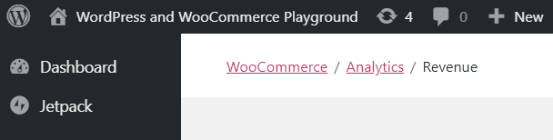

Let's add our extension to this navigation system right away. This is done on the frontend, so we'll take a first look at the JavaScript side of extensions powered by WooCommerce Admin.

1. You need to install 3 new dependencies that provide access to the JavaScript implementation of WordPress filter and action extensibility functions, frontend internationalization functions, and WordPress's own wrapper over React. To do this, run the following command in our extension's root directory: 
    ```shell script
    npm install @wordpress/hooks @wordpress/i18n @woocommerce/components
    ```
2. Open our extension's entry JavaScript file, `src\index.js`.

3. Remove all existing code from `index.js`.  

4. Add import statements to make use of our new dependencies:
    ```javascript
    import {addFilter} from '@wordpress/hooks';
    import {__} from '@wordpress/i18n';
    import {Component as ReactComponent} from '@wordpress/element';
    ```

5. Add a class for a stub React component that we will later expand to host our visualizations:
    ```javascript
    export class SalesByCountryReport extends ReactComponent {
        render() { return null }
    }
    ```

6. Write an `addFilter()` call that adds the report hosted by our extension to the list of WooCommerce Admin reports ([here's how this list is populated inside WooCommerce Admin](https://github.com/woocommerce/woocommerce-admin/blob/fe7b6cca7a095d1a39043bd1b38fc055cf0b121d/client/analytics/report/index.js)), sets a localizable title to use for the report in breadcrumbs navigation, and specifies the React component that the report will use:
    ```javascript
    addFilter('woocommerce_admin_reports_list', 'sample-sales-by-country', (reports) => {
        return [
            ...reports,
            {
                report: 'sample-sales-by-country',
                title: __('Sales by Country', 'sample-sales-by-country'),
                component: SalesByCountryReport
            },
        ];
    });
    ```
For more information about this filter, see [Extending Reports](https://github.com/woocommerce/woocommerce-admin/tree/fe7b6cca7a095d1a39043bd1b38fc055cf0b121d/client/analytics/report#extending-reports) in WooCommerce Admin documentation.

After refreshing our report's page in WordPress admin, we should see the breadcrumbs navigation area correctly populated with the path to the report and its title:

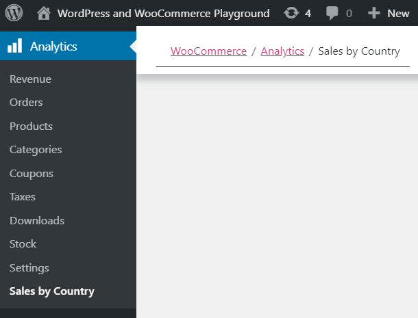

### Exploring available React components

Earlier, when talking about the existing extension that we're taking inspiration from, we have broken it down into constituents. Let's see how we can replicate these using the [library of React components](https://woocommerce.github.io/woocommerce-admin/#/components/) that WooCommerce Admin provides to us:

* A **date range selector** can be expressed by the `ReportFilters` component that combines powerful date range selection with advanced filtering. We won't be implementing advanced filters in our report, but it's nice to know that this option is available. For example, here's how `ReportFilters` combines date range selection and various options for filtering by category in WooCommerce's native *Categories* report:
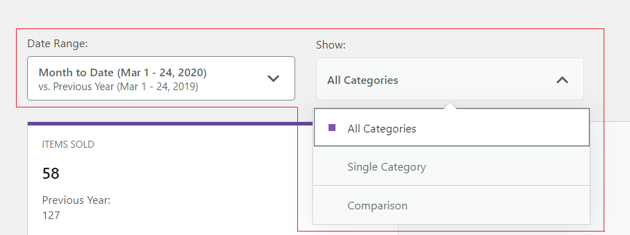
* To **display total sales, orders and countries** for a selected date range, we can use `ReportSummary`. In out-of-the-box reports, this component looks like a set of cards that display stats and show stat-specific charts when clicked on.
* To **display top countries** where orders come from, we'll need to create a wrapper table component like [`RevenueReportTable`](https://github.com/woocommerce/woocommerce-admin/blob/fe7b6cca7a095d1a39043bd1b38fc055cf0b121d/client/analytics/report/revenue/table.js) and similar components that are used in all out-of-the-box reports for tabular data. This one will probably be based on the `TableCard` component that's available to us via the `@woocommerce/components` package.
* For a chart area to **visualize data** based on selected filters, out-of-the-box reports use `ReportChart`. It's built upon another component, `Chart`, that is available via the`@woocommerce/components` package. However, there's something that prevents us from using either of these two components: they both can only plot *time series data* on the X axis. This is fine when we need to break down orders or sales by day, week, month or quarter, but leads us nowhere if we want to break data down by anything other than a time period. Since our goal is to break revenue down by customer country, we'll need to choose a **third-party component**.

### Extracting the extension's main React component to a separate file 

Now that we've discussed available React components, let's extract our main component to a separate file:

1. In the `src` directory that contains JavaScript code for our extension, create a new subdirectory, `components`.

2. Under `components`, create another new subdirectory, `SalesByCountryReport`. This is where we will develop the main React component of our extension. 

3. Under `SalesByCountryReport`, create a new JavaScript file, `SalesByCountryReport.js`.

4. Open our extension's entry JavaScript file, `src\index.js`. Select and cut the stub React component that you created earlier, along with the import statement for `ReactComponent`:
    ```javascript
   // src\index.js
    import {Component as ReactComponent} from '@wordpress/element';
    
    export class SalesByCountryReport extends ReactComponent {
        render() { return null }
    }
    ```

5. Go back to `SalesByCountryReport.js`, and paste the stub component and the import statement.

6. Return to the entry file, `src\index.js`, and add a statement to import the extracted component:
    ```javascript
    import {SalesByCountryReport} from "./components/SalesByCountryReport/SalesByCountryReport";
    ```

We now have a file structure to host our main React component, `SalesByCountryReport`, and extend it further.

### Adding mock data while live data isn't available

Before we move on to fetch real data from WooCommerce REST API, let's use mock data so that we have something to build our UI upon.

1. In the `src` directory where `index.js` resides, create a new JavaScript file called `mockData.js`.

2. Open `mockData.js`, and paste the following code:
    ```javascript
    export const mockData = {
        "countries": [
            {
                "country": "France",
                "country_code": "FR",
                "sales": 33023.23,
                "sales_percentage": 50.37,
                "orders": 4,
                "average_order_value": 8255.8075
            },
            {
                "country": "South Korea",
                "country_code": "KR",
                "sales": 3760.72,
                "sales_percentage": 5.73,
                "orders": 1,
                "average_order_value": 3760.72
            },
            {
                "country": "Canada",
                "country_code": "CA",
                "sales": 1957.3,
                "sales_percentage": 2.98,
                "orders": 6,
                "average_order_value": 326.27
            },
            {
                "country": "Russia",
                "country_code": "RU",
                "sales": 607.44,
                "sales_percentage": 0.92,
                "orders": 3,
                "average_order_value": 202.48
            },
            {
                "country": "Croatia",
                "country_code": "HR",
                "sales": 26225.58,
                "sales_percentage": 40.00,
                "orders": 2,
                "average_order_value": 13112.79
            }
        ],
        "totals": {
            "total_sales": 65574.27,
            "orders": 16,
            "countries": 5
        },
        "loading": false
    };
    ```

3. Go to our main component file, `SalesByCountryReport.js`, and import the mock data file:
    ```javascript
    import {mockData} from '../../mockData';
    ```

4. Add a constructor to the `SalesByCountryReport` class:
    ```javascript
    constructor(props) {
        super(props);

        this.state = {
            data: mockData
        }
    }

    ```
   Now, whenever WooCommerce loads our `SalesByCountryReport` component, its state will be initialized with the imported mock data.

Speaking of state, there are several **approaches to state management** in React: the regular [React state](https://reactjs.org/docs/state-and-lifecycle.html) in class components, the [state hook](https://reactjs.org/docs/hooks-state.html) in function components, [Redux](https://redux.js.org/), as well as the more WordPress-specific [@wordpress/data](https://developer.wordpress.org/block-editor/packages/packages-data/). We're going to use the regular React state for the sake of simplicity, although in larger applications, this approach is arguably not ideal in terms of maintainability and separation of concerns.

### Adding a date range selector

Let's start populating our main component, `SalesByCountryReport`, with other components that will make up our extension's UI. We'll start with WooCommerce's standard [`ReportFilters` component](https://woocommerce.github.io/woocommerce-admin/#/components/packages/filters/README) that out-of-the-box analytics reports use to select a date range. This component is trivial to render and requires no customization, but it does require a few props to be passed to it, and to do that, we'll need to lay some groundwork.

#### The groundwork

1. First, let's install packages that `ReportFilters` requires. To do this, run the following command in our extension's root directory:
    ```shell script
    npm install @woocommerce/date @woocommerce/currency @woocommerce/settings
    ```
   We'll need `@woocommerce/currency` and `@woocommerce/settings` to find out what currency our WooCommerce installation uses, and to apply proper currency formatting to our data. `@woocommerce/date` is used to construct date queries to get data for specific date ranges.

2. Open `SalesByCountryReport.js`, and add 5 new import statements:
    ```javascript
    import {ChartPlaceholder, ReportFilters, SummaryList, SummaryListPlaceholder, SummaryNumber, TablePlaceholder} from '@woocommerce/components';
    import {__} from '@wordpress/i18n';
    import {appendTimestamp, getCurrentDates, getDateParamsFromQuery, isoDateFormat} from '@woocommerce/date';
    import {default as Currency} from '@woocommerce/currency';
    import {CURRENCY as storeCurrencySetting} from '@woocommerce/settings';
    ```
   These statements import all standard WooCommerce components that we're going to use directly in this class, a frontend internationalization function, date processing functions, our store's currency settings, and the `Currency` class to apply these settings.
   
3. In an existing statement that imports from '@wordpress/element', add a new imported item, `Fragment`:
    ```javascript
    import {Component as ReactComponent, Fragment} from '@wordpress/element';
    ```

#### The actual date range selector

Now that the groundwork is complete, let's finally add a date range selector to our main component:

1. Replace the existing `render()` method of the `SalesByCountryReport` class with the following:
    ```javascript
    render() {
        const reportFilters =
            <ReportFilters
                dateQuery={this.state.dateQuery}
                query={this.props.query}
                path={this.props.path}
                currency={this.state.currency}
                isoDateFormat={isoDateFormat}/>;

        return <Fragment>
            {reportFilters}
        </Fragment>
    }
    ```
   This is our actual date range selector, a.k.a the `ReportFilters` component, that React will render into the DOM whenever our main component, `SalesByCountryReport`, is initialized or updated. It takes quite a few props: some passed through directly from the main component, some coming from the main component's state (we'll get to this next). If you're wondering what the `Fragment` component is, it's just a way to [group multiple elements](https://reactjs.org/docs/fragments.html) returned by the `render()` method. Finally, the reason why we've extracted `ReportFilters` to a variable is that we'll later need to return this component both for the final UI and for placeholder UI while data is loading.

2. Replace the existing `constructor()` method of the `SalesByCountryReport` class with the following:
    ```javascript
    constructor(props) {
        super(props);

        const dateQuery = this.createDateQuery(this.props.query);
        const storeCurrency = new Currency(storeCurrencySetting);

        this.state = {
            dateQuery: dateQuery,
            currency: storeCurrency,
            data: mockData
        }
    }
    ```
   This is where we create a date query from the larger query that WooCommerce supplies to our component, in order to pass it over to `ReportFilters` that requires it. This is where we're getting a currency setting from WooCommerce and use it to initialize a `Currency` object that we will later use for currency formatting. We're also saving both `dateQuery` and `currency` to `SalesByCountryReport`'s state because we'll need to pass these values to other components. Note that the method used to create a date query is not implemented yet, so let's fix this.

3. Create a new method in the `SalesByCountryReport` class:
    ```javascript
    createDateQuery(query) {
        const {period, compare, before, after} = getDateParamsFromQuery(query);
        const {primary: primaryDate, secondary: secondaryDate} = getCurrentDates(query);
        return {period, compare, before, after, primaryDate, secondaryDate};
    }
    ```
   We called this method from the constructor to create a date query, and this is how it's implemented. All it does is call two methods that we imported from `'@woocommerce/date'`, and wrap the resulting data into a single object. We'll use this method again when we create an event handler that updates `SalesByCountryReport` every time we select a new date range.

If you refresh our extension's page in the browser, you can see that it now contains a date range selector, just like the one used in out-of-the-box WooCommerce analytics reports. Nice!

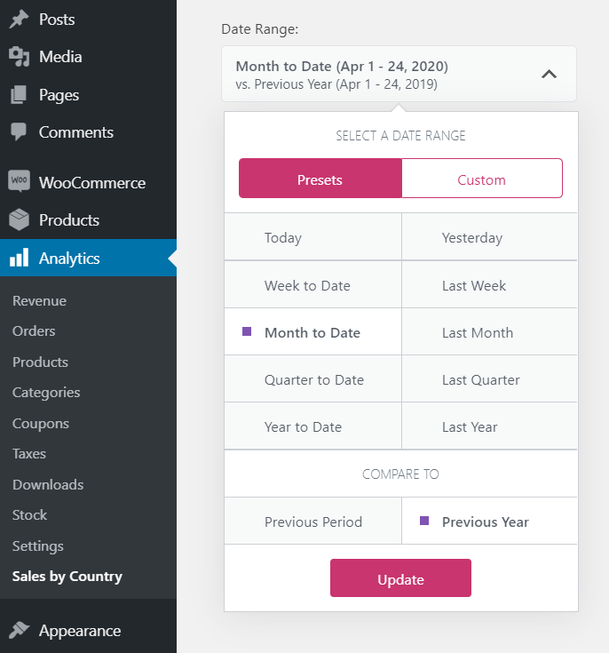

### Adding a report summary

Let's now add a summary area to display total sales, orders and countries. Remember that `SalesByCountryReport` has mock data loaded into its state, and we can display that data for our UI to make sense.

1. In `SalesByCountryReport`'s `render()` method, add the following code right before the `return` statement:
    ```javascript
    const {data, currency} = this.state;
    ```

2. In the `return` statement, in the line following `{reportFilters}`, insert the `SummaryList` component:
    ```javascript
   <SummaryList>
       {() => [
           <SummaryNumber key='sales'
                          value={currency.render(data.totals.total_sales)}
                          label={__('Total Sales', 'sample-sales-by-country')}/>,
           <SummaryNumber key='countries'
                          value={data.totals.countries}
                          label={__('Countries', 'sample-sales-by-country')}/>,
           <SummaryNumber key='orders'
                          value={data.totals.orders}
                          label={__('Orders', 'sample-sales-by-country')}/>
       ]}
   </SummaryList>
    ```

Let's take a closer look at the `SummaryList` component:
* Note how it doesn't receive `SummaryNumber` components as immediate children; instead, it receives a function that returns an array of `SummaryNumber` components.
* Each `SummaryNumber` component has 3 props:
    * The `key` prop provides a stable identity for each `SummaryNumber`. This is important because under the hood, a `SummaryNumber` is a list item, and list items in React [must have unique keys](https://reactjs.org/docs/lists-and-keys.html#keys).
    * In the first `SummaryNumber` component, `value` is formatted with the `render()` method of the `Currency` class that we have instantiated in the constructor. This method makes sure to use the right currency symbol and decimal separator for whatever currency is set as the default in WooCommerce.
    * Labels are wrapped in an internationalization method call, which makes it easy to localize our extension to different languages if necessary.
* To read more about `SummaryList`, `SummaryNumber` and `SummaryListPlaceholder`, [see WooCommerce Admin developer docs](https://woocommerce.github.io/woocommerce-admin/#/components/packages/summary/README).

What if we hit refresh in our browser right now? Let's see:

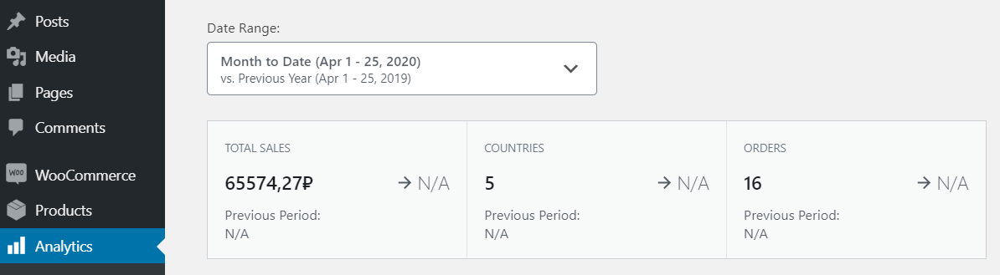 

Looks slick, doesn't it? It feels consistent with other analytics reports, and the total sales number is formatted properly. It does have a few N/A's here and there, and that's because we don't provide data for a previous period to compare the current date range with. In fact, we won't be adding support for previous periods in this tutorial, so let's just make sure these N/A's feel right at home.

### Adding a table view

So far our extension only displays totals for countries, orders and sales. Let's now create a table that will display per-country sales performance.

To do this, we'll use [`TableCard`](https://woocommerce.github.io/woocommerce-admin/#/components/packages/table/README), a component that is shipped as part of the `@woocommerce/components` library and is very similar to what WooCommerce uses in its out-of-the-box analytics reports. It combines a table, a table summary row to display totals, and a pagination control. We won't be using pagination, but otherwise `TableCard` is exactly what we need for tabular data presentation.

#### Creating a custom component to prepare table data

Since `TableCard` requires quite a lot of configuration to define table headers, rows and summary, we'll create a custom component, `CountryTable`, that will host code for this configuration and call `TableCard` with all the required props.

1. In `SalesByCountryReport.js`, add a new statement to the list of existing import statements at the top of the file:
    ```javascript
    import {CountryTable} from '../CountryTable/CountryTable';
    ``` 
    The component that we're importing here doesn't exist yet, but we'll create it in a moment.

2. Scroll down to the `render()` method in `SalesByCountryReport`, and paste the following code after the declaration of the `reportFilters` constant:
    ```javascript
    const tableHeaders = [
        {key: 'country', label: __('Country', 'wc-admin-sales-by-country'), isLeftAligned: true, isSortable: true, required: true},
        {key: 'sales', label: __('Sales', 'wc-admin-sales-by-country'), isSortable: true, isNumeric: true},
        {key: 'sales_percentage', label: __('Sales (percentage)', 'wc-admin-sales-by-country'), isSortable: true, isNumeric: true},
        {key: 'orders', label: __('Number of Orders', 'wc-admin-sales-by-country'), isSortable: true, isNumeric: true},
        {key: 'average_order_value', label: __('Average Order Value', 'wc-admin-sales-by-country'), isSortable: true, isNumeric: true},
    ];
    ```
   This is how we configure table headers for our future `CountryTable` component. The reason we do this inside `SalesByCountryReport` is that later we'll also need to pass these headers to a table placeholder component.  

3. Scroll down to the return statement of the `render()` method. Set the caret at the line after the closing element of our summary list (`</SummaryList>`), and paste the following code:
    ```javascript
    <CountryTable countryData={data.countries}
                  totals={data.totals}
                  currency={currency}
                  headers={tableHeaders}/>
    ```
   This is how we render our `CountryTable` component. It's still not declared though, so let's do this.

4. Under `src\components`, create a new subdirectory, `CountryTable`. 

5. Under `CountryTable`, create a new JavaScript file, `CountryTable.js`.

6. Open `CountryTable.js`, and paste the following code:
    ```javascript
    import {__} from '@wordpress/i18n';
    import {Component as ReactComponent} from '@wordpress/element';
    import {TableCard} from '@woocommerce/components';
    
    export class CountryTable extends ReactComponent {
    
        render() {
            const countryData = this.props.countryData;
            const totals = this.props.totals;
            const currency = this.props.currency;
    
            const tableData = {
                headers: this.props.headers,
                rows: countryData.map(item =>
                    [
                        {display: item.country, value: item.country},
                        {display: currency.render(item.sales), value: item.sales},
                        {display: `${item.sales_percentage}%`, value: item.sales_percentage},
                        {display: item.orders, value: item.orders},
                        {display: currency.render(item.average_order_value), value: item.average_order_value},
                    ]),
                summary: [
                    {key: 'sales', label: __('Sales in this period', 'wc-admin-sales-by-country'), value: currency.render(totals.total_sales)},
                    {key: 'orders', label: __('Orders in this period', 'wc-admin-sales-by-country'), value: totals.orders},
                    {key: 'countries', label: __('Countries in this period', 'wc-admin-sales-by-country'), value: totals.countries},
                ]
            };
    
            return <TableCard
                title={__('Top Countries', 'wc-admin-sales-by-country')}
                rows={tableData.rows}
                headers={tableData.headers}
                rowsPerPage={100}
                totalRows={tableData.rows.length}
                summary={tableData.summary}
            />
        }
    }
    ```

Let's see what's inside the code you've just pasted:
* `CountryTable` is another React class component that currently only has the `render()` method implemented. There's no state in this component yet, so we can safely skip any custom constructor logic.
* In `render()`, the `tableData` constant collects headers, rows, and summary that are later passed to WooCommerce's native `TableCard` component:
    * `headers` is used exactly as declared in (and passed over from) `SalesByCountryReport`.
    * `rows` is incoming per-country data transformed so that for each cell in a table row, `TableCard` has a raw value that can be used for sorting, and a display value that can be currency-formatted or otherwise decorated.
    * `summary` contains labels and display values for `TableCard`'s summary block that is rendered after the table.
* When the `render()` method returns a `TableCard`, it passes a set of props, including `headers`, `rows` and `summary` and we've just discussed. Other props are `title` for the table name displayed in the card header, as well as `rowsPerPage` and `totalRows` that are normally used for pagination purposes. We're not going to implement pagination in our extension, but since these two parameters are required, we'll include them anyway.

When we refresh our extension's report page, here's what we should see:

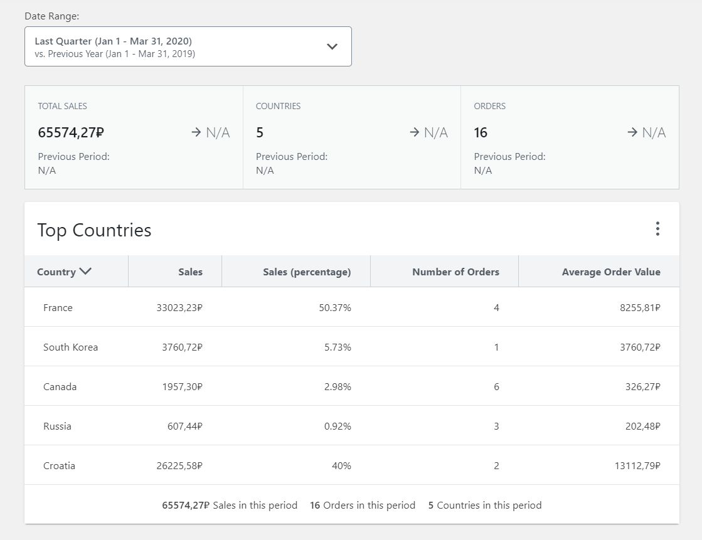

We now have a table component populated with our mock per-country sales data, along with a card header that lets you hide or show columns, and the summary block.

What happens when we click a header? Well, nothing, because we haven't implemented any kind of sorting so far. Let's do this next.

#### Making the table view sortable

##### Applying the default sort order

Sorting per-country data in our table is probably something that the table itself should be responsible for. If so, we need a way for the table to store data sorted in a particular way. For that, we'll need to add state to the `CountryTable` component, and initialize the state in a constructor.

1. In the `CountryTable` class, add the following constructor:
    ```javascript
    constructor(props) {
        super(props);

        const defaultSortColumn = 'sales';
        const defaultSortOrder = 'desc';

        const countryDataSortedByDefault = this.sort(this.props.countryData, defaultSortColumn, defaultSortOrder);

        this.state = {
            countryData: countryDataSortedByDefault,
            sortColumn: defaultSortColumn,
            sortOrder: defaultSortOrder
        }
    }
    ``` 
    In the constructor, we define sorting defaults: when rendering the table initially, we want it sorted by absolute sales (`defaultSortColumn`) in descending order (`defaultSortOrder`). Next, we call a `sort()` method (which is yet to be defined) and pass these defaults along with the data received as props from our main component. Finally, we save the resulting sorted data along with applied sort and order options to a state object. Now, let's implement the sorting method.

2. Add the following method to the `CountryTable` class:
    ```javascript
    sort(data, column, sortOrder) {
        const appliedSortOrder = sortOrder === 'asc' ? 1 : -1;
        return data.sort((a, b) => {
            if (a[column] > b[column]) return appliedSortOrder;
            if (a[column] < b[column]) return -1 * appliedSortOrder;
            return 0;
        });
    }
    ```
    Our `sort()` method in `CountryTable` invokes JavaScript's [built-in array sort method](https://developer.mozilla.org/en-US/docs/Web/JavaScript/Reference/Global_Objects/Array/sort) on our per-country data array, and passes it a function that defines what exactly should be compared &mdash; values in the particular column that we want to sort by. However, before doing this, the `appliedSortOrder` constant establishes the sort order that we want to apply. If the method receives a string representing the ascending order, the `appliedSortOrder` constant is assigned `1`, which doesn't have any effect on the subsequent sort operation. If the method receives a string representing the descending order, `appliedSortOrder` is set to `-1`, and when passed to the compare function, this value reverses the order of items in the resulting sorted array.
   
3. A constructor, `sort()`, and `applySortOrder()` is all we need to get per-country data sorted by default. In order to actually render the sorted data, we need to make a small but important change. In the first line in `render()`, you should have the `countryData` constant declared and initialized. Select its initialization expression, `this.props.countryData`, and replace it with this:
    ```javascript
    this.state.countryData
    ```
   
##### Enabling changes to sort column and order

So far we've managed to apply the default sort order to the per-country data that the `CountryTable` component receives from `SalesByCountryReport`. What we need to do now is make sure that whenever we click a table header, data in the table either changes its sort order or is re-sorted by a new column. This will require a few changes to the `CountryTable` class:

1. In the return statement of `CountryTable`'s `render()` method, add a new prop to the `TableCard` component that you return:
    ```javascript
    onSort={this.handleSort}
    ``` 
    This tells `TableCard` that whenever a sortable table header is clicked, it should invoke the `handleSort()` method defined in `CountryTable`. Well, it's not actually defined yet, so let's do that next.
    
2. Insert a new method, `handleSort()`, into the `CountryTable` class:
    ```javascript
    handleSort(newSortColumn) {
        let {countryData, sortColumn, sortOrder} = this.state;

        if (sortColumn === newSortColumn) {
            countryData.reverse();
            sortOrder = this.changeSortOrder(sortOrder);
        }
        else {
            sortColumn = newSortColumn;
            countryData = this.sort(countryData, sortColumn, sortOrder);
        }

        this.setState({
            countryData: countryData,
            sortColumn: sortColumn,
            sortOrder: sortOrder
        });
    }

    ```
   This is the method that we want to invoke whenever a sortable table header is clicked. The method receives one argument, which is a key for the header that was clicked, and it helps us identify which column the user wants to re-sort by. If table data is currently sorted by that column, we just reverse the sort order. If table data is currently sorted by a different column than that passed over to the method, we re-sort by the new column without changing the sort order. Finally, we save re-sorted data, current sort column and sort order to component state. When React detects that state has been updated, it automatically re-renders the `CountryTable` component for us.
   
3. The `handleSort()` method calls another method, `changeSortOrder()`, which isn't currently defined, and we need to fix this. Insert the following new method into the `CountryTable` class:
    ```javascript
    changeSortOrder(order) {
        return order === 'asc' ? 'desc' : 'asc';
    }
    ```

4. Since we're passing `handleSort` as a prop to `TableCard`, and `this` in JavaScript works [the way it works](https://developer.mozilla.org/en-US/docs/Web/JavaScript/Reference/Operators/this), we need to [bind](https://developer.mozilla.org/en-US/docs/Web/JavaScript/Reference/Operators/this#The_bind_method) `handleSort()` to the context of the `CountryTable` class. To do this, insert the following code at any line after `super(props)` in `CountryTable`'s constructor: 
    ```javascript
            this.handleSort = this.handleSort.bind(this);
    ```

5. Insert the following new method into the `CountryTable` class:
    ```javascript
    setHeaderSortOptions(header) {
        if (header.key === this.state.sortColumn) {
            header.defaultSort = true;
            header.defaultOrder = this.state.sortOrder;
        } else {
            if (header.defaultSort) delete header.defaultSort;
            if (header.defaultOrder) delete header.defaultOrder;
        }
        return header;
    }
    ```
   This method locates the header of a column that data is currently sorted by, and assigns additional properties, `defaultSort` and `defaultOrder`, to that header. At the same time, these two properties are removed from headers of all other columns. As a result, the current sort column gets highlighted, and its header properly indicates the current sort order. Now, let's just add a call to this method in the next step.

6. In `CountryTable`'s `render()` method, locate the `tableData` const and its `headers` property. Replace the current value of the `headers` property (`this.props.headers`) with this:
    ```javascript
    this.props.headers.map(header => this.setHeaderSortOptions(header))
    ```

At this point, we should be all set with re-sorting data. After refreshing the page of our extension in your browser, try clicking column headers and see what happens. What you should see is data re-sorted, current sort column highlighted, and sort order indicators in headers correctly displayed:

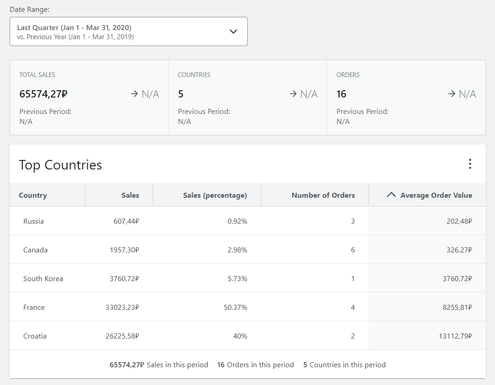

### Fetching real data

Our extension already looks nice &mdash; that is, until we realize that we're still dealing with mock data. It's time to start writing code that will get us real, live data from our WooCommerce installation, and then transform the data to the format that we expect. Let's get started.

1. In the constructor of `SalesByCountryReport`, select the entire statement that initializes `this.state`, and replace it with the following:
    ```javascript
    this.state = {
        dateQuery: dateQuery,
        currency: storeCurrency,
        allCountries: [],
        data: { loading: true }
    };
    ```
   We have added and initialized two state properties:
   * `allCountries` will store all countries that our WooCommerce installation knows about. Since the set of countries isn't going to change, we will fetch it once, store it in this state property, and read it from there instead of re-fetching.
   * `data.loading` will be used as a switch to tell React what to render: if data has not finished loading (`data.loading === true`), we want to display some kind of placeholder on our extension's page; if it has finished loading (`data.loading === false`), we want to display the actual loaded data.

2. In the next line in the constructor, insert another statement:
    ```javascript
    this.fetchData(this.state.dateQuery);
    ```
   Since we no longer use mock data, we're calling the `fetchData()` method from the constructor to start requesting initial data when our component is loaded for the first time. The method is not defined yet, and our next step is to fix this.
   
3. Paste a new method into `SalesByCountryReport`:
    ```javascript
    fetchData(dateQuery) {

        if(!this.state.data.loading) this.setState({data: {loading: true}});

        const endPoints = {
            'countries': '/wc/v3/data/countries?_fields=code,name',
            'orders': '/wc-analytics/reports/orders?_fields=order_id,date_created,date_created_gmt,customer_id,total_sales',
            'customers': '/wc-analytics/reports/customers?_fields=id,country'
        };

        const queryParameters = this.getQueryParameters(dateQuery);
        const countriesPath = endPoints.countries;
        const ordersPath = endPoints.orders + queryParameters;
        const customersPath = endPoints.customers + queryParameters;

        Promise.all([
            this.state.allCountries.length === 0 ? apiFetch({path: countriesPath}) : Promise.resolve(this.state.allCountries),
            apiFetch({path: ordersPath}),
            apiFetch({path: customersPath})
        ])
            .then(([countries, orders, customers]) => {
                const data = this.prepareData(countries, orders, customers);
                this.setState({data: data, allCountries: countries})
            })
            .catch(err => console.log(err));
    }
    ```
   Let's see what's going on here:
   * First, we make sure that the `data.loading` state property is set to `true`, which we'll use to show a placeholder while data is loading. This line won't be executed when the method is called from the constructor, because in this case `data.loading` is already set to `true`; however, we'll need this line later, as we learn to update data when a selected date range changes.
   * Next, we declare `endPoints` &mdash; an object that holds relative paths to the 3 [WooCommerce REST API](http://woocommerce.github.io/woocommerce-rest-api-docs/) endpoints that we'll use to fetch data. Since all these endpoints can return more data than we need, we append the [`_fields` query parameter](https://developer.wordpress.org/rest-api/using-the-rest-api/global-parameters/#_fields) to limit the data fields that are sent to our extension.
   * When URLs for our endpoints are ready, we start requesting them asynchronously using `Promise.all`, which will only let us proceed once responses to all requests have been received and the corresponding promises resolved. Note that a request to the `countries` endpoint is only sent if countries are not yet saved to component state.
   * As soon as all promises are resolved, the `prepareData()` method transforms data to a format we can use to populate our report. We'll declare `prepareData()` later.
   * Whatever `prepareData()` returns is put into the component state, and when the state updates, React triggers re-rendering of the component with ready-to-use data.

4. `fetchData` uses a method, `apiFetch`, from a library that we don't have installed yet. To fix this, run the following command in the root directory of our extension:
    ```shell script
    npm install @wordpress/api-fetch
    ```

5. Back in `SalesByCountryReport`, scroll up to the imports section, and add a new import statement:
    ```javascript
    import apiFetch from '@wordpress/api-fetch';
    ```

6. Add the following method into `SalesByCountryReport`:
    ```javascript
        getQueryParameters(dateQuery) {
            const afterDate = encodeURIComponent(appendTimestamp(dateQuery.primaryDate.after, 'start'));
            const beforeDate = encodeURIComponent(appendTimestamp(dateQuery.primaryDate.before, 'end'));
            return `&after=${afterDate}&before=${beforeDate}&interval=day&order=asc&per_page=100&_locale=user`;
        }
    ```
   We call this method from `fetchData()` to get a set of query parameters to use when requesting REST API endpoints. Some of these parameters are hardcoded, but the two parameters that define the boundaries of a date range are calculated. Notably, we append timestamps to both dates, and then encode the resulting timestamps in a way that's suitable for use in URLs.
   
7. Insert a new method into `SalesByCountryReport`:
    ```javascript
    prepareData(countries, orders, customers) {
        let data;

        if (orders.length > 0) {
            const ordersWithCountries = this.getOrdersWithCountries(orders, customers, countries);
            data = this.getPerCountryData(ordersWithCountries);

            data.totals = {
                total_sales: this.getTotalNumber(data.countries, 'sales'),
                orders: this.getTotalNumber(data.countries, 'orders'),
                countries: data.countries.length,
            };

            data.countries = data.countries.map(country => {
                country.sales_percentage = Math.round(country.sales / data.totals.total_sales * 10000) / 100;
                country.average_order_value = country.sales / country.orders;
                return country;
            });
        } else {
            data = {
                countries: [],
                totals: {
                    total_sales: 0,
                    orders: 0,
                    countries: 0
                }
            }
        }

        data.loading = false;

        return data;
    }
    ```
   This method is responsible for transforming the data received from REST API endpoints to a format used in our component state. If we have received data on at least a single order in a requested date range, we call 2 methods that we'll discuss next, `getOrdersWithCountries()` and `getPerCountryData()`. This gives us a basic per-country data structure that we then extend with sales, order and country totals, as well as calculated sales percentages and average order values for each country. 
   
8. Add another method to `SalesByCountryReport`:
    ```javascript
    getOrdersWithCountries(orders, customers, countries) {
        return orders.map(order => {
            order.country_code = customers.find(item => item.id === order.customer_id).country;

            const country = countries.find(item => item.code === order.country_code);
            order.country = country ? country.name : __('Unknown country', 'wc-admin-sales-by-country');

            return order;
        });
    }
    ```
   This method is called from `prepareData()`, and it maps each order to a specific country that the order was made from. To do this, it first gets a country code from a customer entry that matches a given customer ID, and then it finds the full country name by a given country code in the `countries` array. Some customers may not have country information in their profiles, and if that's the case, an order is tagged with "Unknown country".
   
9. Add (you guessed it) yet another method to `SalesByCountryReport`:
    ```javascript
    getPerCountryData(ordersWithCountries) {
        return ordersWithCountries.reduce((accumulator, currentObject) => {
            const countryCode = currentObject['country_code'];

            if (!accumulator.countries) accumulator.countries = [];

            if (!accumulator.countries.find(item => item.country_code === countryCode)) {
                const countryObjectTemplate = {
                    'country': currentObject['country'],
                    'country_code': countryCode,
                    'sales': 0,
                    'sales_percentage': 0,
                    'orders': 0,
                    'average_order_value': 0
                };
                accumulator.countries.push(countryObjectTemplate)
            }

            const countryIndexInAccumulator = accumulator.countries.findIndex(item => item.country_code === countryCode);
            accumulator.countries[countryIndexInAccumulator].sales += currentObject.total_sales;
            accumulator.countries[countryIndexInAccumulator].orders++;

            return accumulator;
        }, {});
    }
    ```
   This is another method called from `prepareData()`. Essentially, it takes an array of orders with information on which countries they were made from, and transforms it into an array of countries. For each country, it calculates total sales and the number of orders made. 
   
10. Add the final `SalesByCountryReport` method that you'll need in this section:
    ```javascript
    getTotalNumber(data, property) {
        const propertyTotal = data.reduce((accumulator, currentObject) => accumulator + currentObject[property], 0);
        return Math.round(propertyTotal * 100) / 100;
    }
    ```
    This is the last method called from `prepareData()` that we needed to define. This is a utility method that calculates the total for a given numerical property (such as sales or orders), and returns it after rounding.
   
11. In the `render()` method, select the entire return statement, and replace it with this:
    ```javascript
    if (this.state.data.loading) { return <p>Waiting...</p> }
    else {
        return <Fragment>
            {reportFilters}
            <SummaryList>
                {() => [
                    <SummaryNumber key='sales'
                                   value={currency.render(data.totals.total_sales)}
                                   label={__('Total Sales', 'sample-sales-by-country')}/>,
                    <SummaryNumber key='countries'
                                   value={data.totals.countries}
                                   label={__('Countries', 'sample-sales-by-country')}/>,
                    <SummaryNumber key='orders'
                                   value={data.totals.orders}
                                   label={__('Orders', 'sample-sales-by-country')}/>
                ]}
            </SummaryList>
            <CountryTable countryData={data.countries}
                          totals={data.totals}
                          currency={currency}
                          headers={tableHeaders}/>
        </Fragment>
    }
    ```
    This revision of the return statement adds a condition whereby a set of components that hold data is only returned once data has finished loading. While data is still loading, only a short progress message is rendered. (Later, we will replace this quick progress message with a more professional looking set of placeholder components.)

12. Since we're no longer using mock data, scroll up to the imports section in `SalesByCountryReport`, and remove the line that imports `{mockData}`.

13. Go to the root of the `src` folder, and delete `mockData.js`: you won't need it from now on.

Let's refresh our extension page, and see what it displays:
 
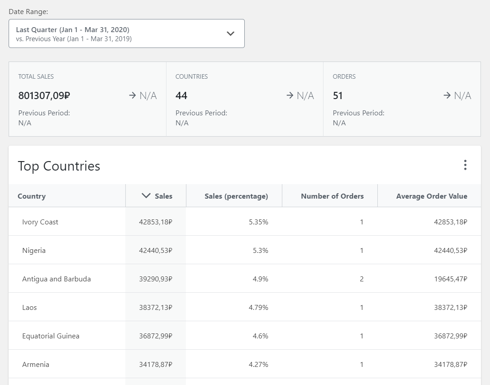

This smells like success! There are 44 countries listed for the selected period: if we scroll down a few times, here's what the end of the table looks like:

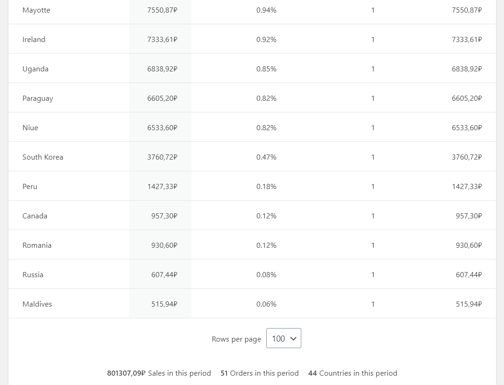

Granted, since this is live data, you'll see different numbers, and probably a different currency setting, in your own installation.

### Updating data when a new date range is selected

Fetching live data from REST API and displaying it in our report is a good start, but we don't currently have a working way to update the data when we select a new date range using the `ReportFilters` component. It's time to fix this.

1. In `SalesByCountryReport`'s `render()` method, find where you're calling the `ReportFilters` component, and add a new prop to the call:
    ```javascript
    onDateSelect={this.handleDateChange}
    ```
   We're telling `ReportFilters` to call `handleDateChange()` every time we select a new date range and click *Update*. Next, let's declare `handleDateChange()` itself.
   
2. Add a new method to `SalesByCountryReport`:
    ```javascript
    handleDateChange(newQuery) {
        const newDateQuery = this.createDateQuery(newQuery);
        this.setState({dateQuery: newDateQuery});
        this.fetchData(newDateQuery);
    }
    ``` 
   Every time `ReportFilters` changes a date range, `handleDateRange()` will receive an argument representing this new date range. It needs to be processed into a proper date query similar to we did with the original date range in the constructor. Once that's done, `handleDateRange()` saves the new date query into component state, and calls `fetchData` to send API requests for the new date range, and process it further as we discussed above. For all this to work, we need to remember to make one more small change.
   
3. Scroll up to the constructor in `SaleseByCountryReport`, and add the following code at any line after the `super(props)` call:
    ```javascript
    this.handleDateChange = this.handleDateChange.bind(this);
    ``` 
   Once again, we need this to bind `handleDateChange()` to the context of `SalesByCountryReport`.

This is all we need to do to enable updating data when a new date range is selected! Update our extension's page, and try playing with the date range selector to get data for different periods.

### Adding native placeholder components to display while data is loading

When data is loading, our extension currently says "Waiting...", and that's all it does. This works, but we can do better. Let's add the exact same placeholder components that out-of-the-box reports in WooCommerce use:

1. In `SalesByCountryReport`'s `render()` method, you should now have two conditional return statements. Locate the return statement that executes when data is loading (`this.state.data.loading`), and replace it with the following code:
    ```javascript
    return <Fragment>
        {reportFilters}
        <SummaryListPlaceholder numberOfItems={3}/>
        <ChartPlaceholder height={300}/>
        <TablePlaceholder caption={__("Top Countries", "wc-admin-sales-by-country")}
                          headers={tableHeaders}/>
    </Fragment>
    ```
   These are placeholder components for summary list, chart, and table that WooCommerce provides as part of its React component library. For the summary list placeholder, we specify how many summary blocks we want, for the chart we specify the desired height in pixels, and for the table we provide a caption and the same set of headers that we pass over to our `CountryTable` component. Note that before any of these components, we render the same `ReportFilters` that we use for loaded data. That's because it doesn't need to wait for new data: it already displays the new date range.

When you refresh our extension's page in the browser, here's what you should see while data is loading:

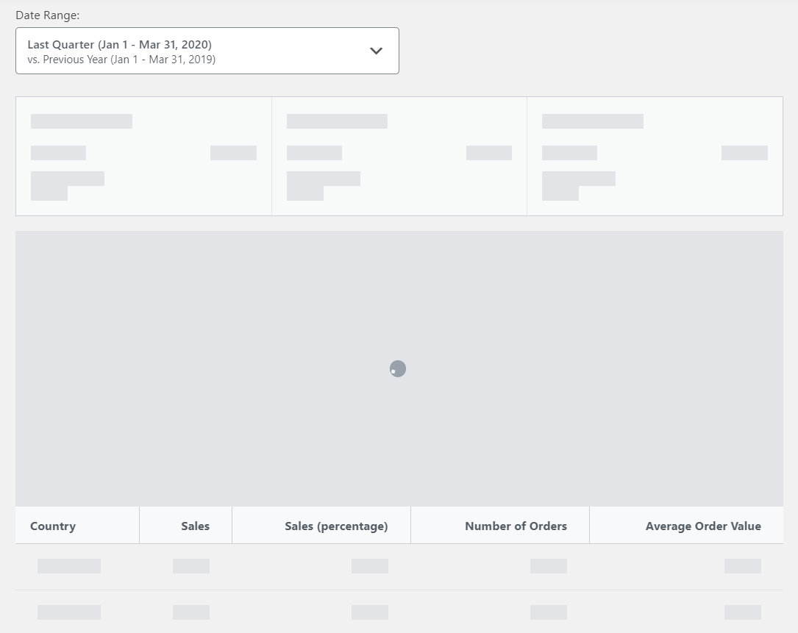

### Adding a chart component to visualize per-country data

We have just added a set of placeholder components, and one of them was for a chart component. The problem is that we don't currently have a *real* chart component to visualize country data. This is what we're going to address now.

As you may recall, native chart components provided by WooCommerce are limited in that they can only plot time series data on the X axis. Because we want to break data down by country instead of a time period, we'll need to go with a third-party React component. There's quite a choice of libraries to use, including [canvasJS](https://canvasjs.com/react-charts/), [Recharts](https://recharts.org/en-US/), [ApexCharts](https://apexcharts.com/docs/react-charts/), and [Victory](https://formidable.com/open-source/victory/). We'll go with Recharts for this example.

#### Integrating a third-party bar chart component

1. To install Recharts, run the following command in the root directory of our extension:
   ```shell script
   npm install recharts
   ```

2. Go to `SalesByCountryReport.js`. In the `render()` method, you should have a destructuring assignment statement that goes like this: `const {data, currency} = this.state;`. Modify it so that it includes `dateQuery` as well:
    ```javascript
    const {data, currency, dateQuery} = this.state;
    ```

3. Scroll down to `render()`'s return statement that executes when data has been loaded. Between `SummaryList` and `CountryTable` component calls, insert a new component call:
    ```javascript
    <CountryChart chartData={data.countries}
                  dateRange={dateQuery.primaryDate.range}
                  currency={currency}/>
    ```

4. Scroll up to the imports section in `SalesByCountryReports.js`, and add a new import statement:
    ```javascript
    import {CountryChart} from '../CountryChart/CountryChart';
    ```
   This is all we need to do in our main component, `SalesByCountryReports`, and it's now time to actually create the chart component that we have already imported and called.
   
5. Under `src\components`, create a new subdirectory, `CountryChart`. 

6. Under `CountryChart`, create a new JavaScript file, `CountryChart.js`.

7. Open `CountryChart.js`, and paste the following code:
    ```javascript
    import {__} from '@wordpress/i18n';
    import {Component as ReactComponent} from '@wordpress/element';
    import {Bar, BarChart, CartesianGrid, ResponsiveContainer, Tooltip, XAxis, YAxis} from 'recharts';
    
    export class CountryChart extends ReactComponent {
        render() {
            const chartData = this.props.chartData
                .map(country => ({name: country.country, value: country.sales}))
                .sort((a, b) => {
                    if (a.value > b.value) return -1;
                    if (a.value < b.value) return 1;
                    return 0;
                });
    
            return <div className='countrychart-chart'>
                <div className='countrychart-chart__header'>
                    <h2 className='countrychart-chart__title'>Sales by Country</h2>
                </div>
                <div className='countrychart-chart__body countrychart-chart__body-column'>
                    <div className='d3-chart__container'>
                        <ResponsiveContainer width='100%' height={300}>
                            {chartData.length > 0
                                ? (<BarChart data={chartData}>
                                    <CartesianGrid vertical={false}/>
                                    <Bar dataKey='value' fill='#52accc'/>
                                    <XAxis dataKey='name'/>
                                    <YAxis domain={[0, dataMax => (Math.round(dataMax * 1.05 / 100) * 100)]}/>
                                </BarChart>)
                                : <div className='d3-chart__empty-message'>{__('No data for the selected date range', 'wc-admin-sales-by-country')}</div>
                            }
                        </ResponsiveContainer>
                    </div>
                </div>
            </div>
        }
    }
    ```
   Let's see what's going on here:
   * This is a stateless component, and it only has one method: `render()`.
   * Before returning anything from `render()`, we transform the incoming array of country data into a format that our bar chart component understands. Then, we sort the resulting array by absolute sales, and save it into the `chartData` constant.
   * In the return statement, we check if `chartData` contains data for at least one country, and if it does, we visualize the data using the [`BarChart` component](https://recharts.org/en-US/api/BarChart) imported from Recharts. If `chartData` is empty, we instead show a message indicating that there's no data for a selected date range.
   * Note the `YAxis` component that is nested within `BarChart`. It receives a prop called `domain` that defines the range of possible values plotted on the Y axis. Since we want to leave some space between the highest bar in our chart and the chart's upper boundary, we take the largest data point in `chartData`, multiply it by 1.05, and round down to an integer.
   * The `BarChart` component is wrapped in another Recharts component, `ResponsiveContainer`, that helps the bar chart adapt to various screen sizes.
   * `ResponsiveContainer` is wrapped in a cascade of `div` elements that use classes from WooCommerce's own spreadsheets. This helps make our component feel as consistent with native components as possible.
   
If we now refresh our extension's page in the browser, we should see something like this:

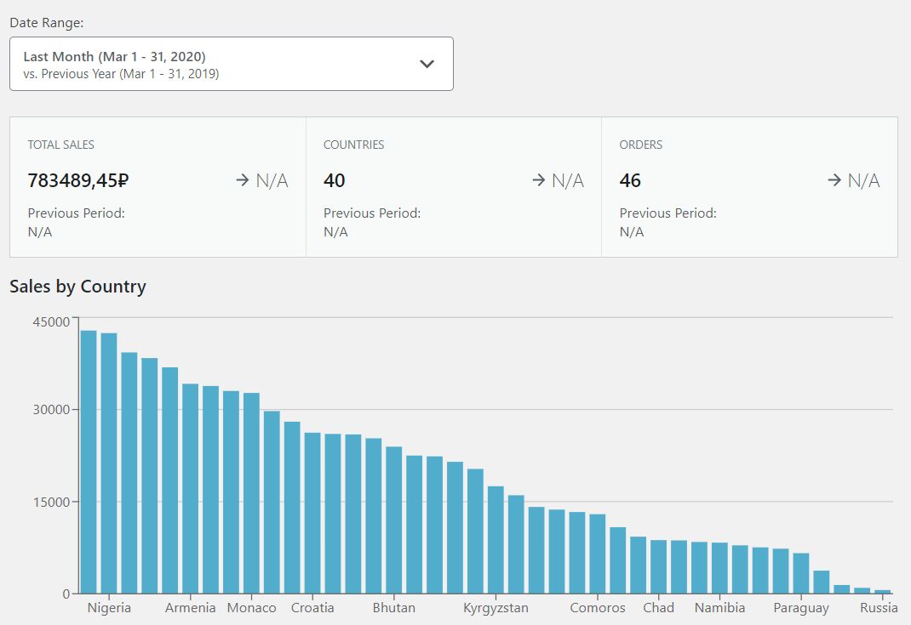

#### Adding a custom tooltip

Having a bird's-eye view of sales breakdown by country like this is useful, but still there's something missing. What if we want to see how much revenue came from a country represented by the 18th bar from the left? That's hard to do right now, and to make it easy, we need to implement a tooltip for the bar chart.

1. Under `src\components`, create a new subdirectory, `CustomTooltip`. 

2. Under `CustomTooltip`, create a new JavaScript file, `CustomTooltip.js`.

3. Open `CustomTooltip.js`, and paste the following code:
    ```javascript
    import {Component as ReactComponent} from '@wordpress/element';
    
    export class CustomTooltip extends ReactComponent {
        render() {
            return <div className='d3-chart__tooltip'>
                <h4>{this.props.dateRange}</h4>
                <ul>
                    <li className='key-row'>
                        <div className='key-container'>
                            <span className='key-color' style={{backgroundColor: '#096484'}}/>
                            <span className='key-key'>{this.props.label}</span>
                        </div>
                        <span className='key-value'>{this.props.currency.render(this.props.payload[0].value)}</span>
                    </li>
                </ul>
            </div>
        }
    }
    ```
   This is a simple component that displays a tooltip with a date range, country name (passed in as `this.props.label`), and total sales (passed in as the first array item in `this.props.payload`). For style consistency, the component uses markup structure and styles taken from WooCommerce's own tooltips in out-of-the-box analytics reports.

4. Go back to `CountryChart.js`, and add two new import statements:
    ```javascript
   import {CustomTooltip} from '../CustomTooltip/CustomTooltip';
   import './CountryChart.scss'
    ```

5. Scroll down to the `render()` method in `CountryChart`, and paste the following code as a nested component of `BarChart`, next to `XAxis`, `YAxis`, and other nested components:
    ```javascript
    <Tooltip
        cursor={{fill: 'rgba(0, 0, 0, 0.1)'}}
        content={({active, payload, label}) => {
            return !active ? null :
                (<CustomTooltip payload={payload}
                                label={label}
                                dateRange={this.props.dateRange}
                                currency={this.props.currency}/>);
        }}/>
    ```
   `Tooltip` is Recharts' own tooltip component that allows to customize its content with the `content` prop. This prop receives a function that checks if the tooltip is currently active (that is, if the user has hovered over a bar in the chart), and if it is, it displays our own custom tooltip that we have just created and imported.
   
6. Under `src\components\CountryChart`, create a new Scss stylesheet, `CountryChart.scss`.

7. Open `CountryChart.scss`, and paste the following styles:
    ```scss
    .recharts-tooltip-wrapper .d3-chart__tooltip {
      visibility: visible !important;
      left: 24px;
      top: 24px;
    }
    ```

If we now refresh our extension's page and hover over a bar in the bar chart, we should now see a tooltip showing total sales for the selected country:

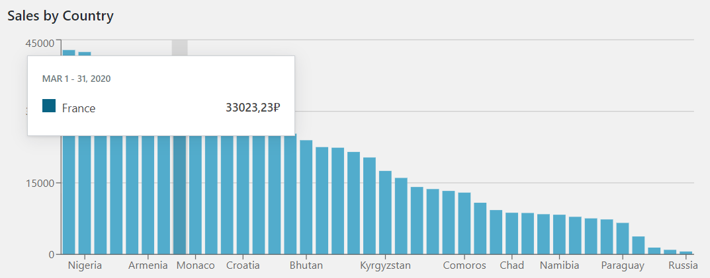

#### Styling the bar chart

Our bar chart is fully functional, which is great! Still, there are a few details about its appearance that can be improved: borders, background, axis lines, tick lines, tooltip margins, and fonts used for labels. Let's add styles that will address these issues.

1. Open `CountryChart.scss`, select all content, and replace it with the following styles:
    ```scss
    $font-family: -apple-system, BlinkMacSystemFont, "Segoe UI", Roboto, Oxygen-Sans, Ubuntu, Cantarell, "Helvetica Neue", sans-serif;
    $studio-white: #fff;
    $core-grey-light-700: #ccd0d4;
    $gap-large: 24px;
    $gap: 16px;
    $wp-admin-sidebar: #24292d;
    
    .recharts-yAxis.yAxis line {
      stroke: transparent;
    }
    
    .recharts-yAxis .recharts-cartesian-axis-tick-line {
      visibility: hidden;
    }
    
    .recharts-tooltip-wrapper .d3-chart__tooltip {
      visibility: visible !important;
      left: $gap-large;
      top: $gap-large;
    }
    
    .recharts-cartesian-axis text tspan
    {
      font-family: $font-family;
      font-size: 10px;
    }
    
    .recharts-cartesian-grid-horizontal line {
      stroke: #e2e4e7;
      stroke-width: 1;
      shape-rendering: crispEdges;
    }
    
    .countrychart-chart {
      margin-top: -$gap;
      margin-bottom: $gap-large;
      background: $studio-white;
      border: 1px solid $core-grey-light-700;
      border-top: 0;
    
      .countrychart-chart__header {
        min-height: 50px;
        border-bottom: 1px solid $core-grey-light-700;
        display: flex;
        flex-flow: row wrap;
        justify-content: space-between;
        align-items: center;
        width: 100%;
    
        .countrychart-chart__title {
          height: 18px;
          color: $wp-admin-sidebar;
          font-size: 15px;
          font-weight: 600;
          line-height: 18px;
          margin-left: $gap;
          margin-right: $gap;
        }
      }
    
      .countrychart-chart__body {
        display: flex;
        flex-direction: row;
        justify-content: flex-start;
        align-items: flex-start;
        width: 100%;
    
        &.countrychart-chart__body-column {
          flex-direction: column;
          margin-top: $gap;
        }
      }
    }
    ```

If we refresh our extension's page in the browser, here's what we'll see:

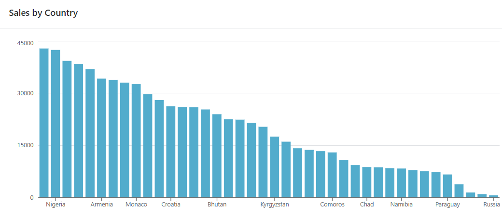

This is much nicer! Background color, layout of the chart header, font properties used in chart labels, transparent ticks on the Y axis, line strokes in the grid: the new styles make the bar chart component way less contrasting when put next to native components.

### Finishing touches

We're almost done, and there's only one minor thing left to do. Our bar chart and our table both have headers, and the styles of these headers currently look very different:

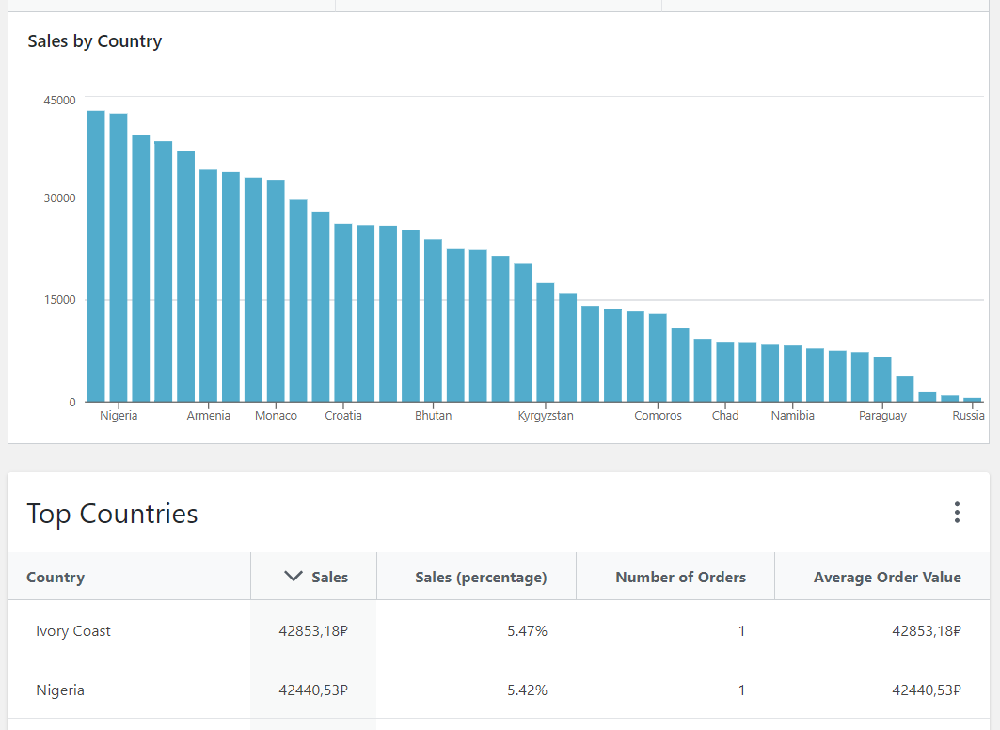

Let's modify the table header to make it look consistent with the bar chart header:

1. Go to `src\components\CountryTable`, and create a new Scss stylesheet, `CountryTable.scss`.

2. Open `CountryTable.scss`, and paste the following styles:
    ```scss
    .table_top_countries h2 {
      font-size: 15px;
      font-weight: 600;
    }
    ```

3. Go to `CountryTable.js`, and add a new import statement:
    ```javascript
    import './CountryTable.scss'
    ```

4. Scroll down to `CountryTable`'s `render()` method, and in the return statement, add the following prop to the `TableCard` component:
    ```javascript
    className="table_top_countries"
    ```

This should be enough to make the styles of the two headers look alike:

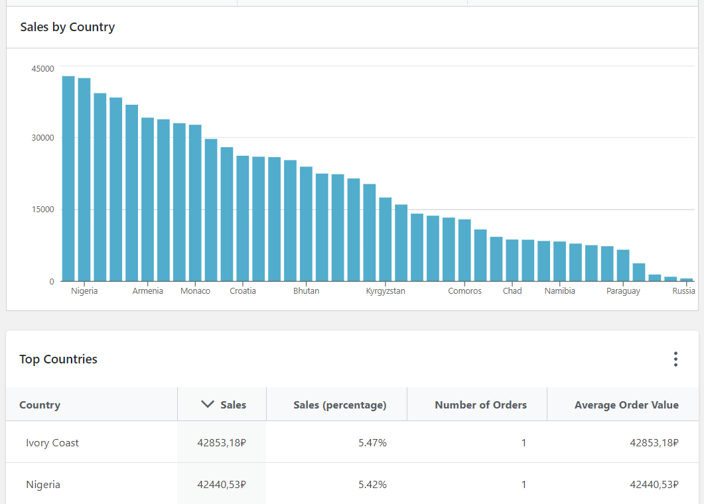

Finally, let's get rid of something that we haven't used since it was generated: under `src\components`, delete the empty `index.scss` stylesheet.

### That's it!

We have come a long way since facing the boilerplate extension code that WooCommerce helped us generate. What we have now is a fully functional WooCommerce extension that fetches and transforms WooCommerce store data via REST API, visualizes the data using components provided by WooCommerce, as well as third-party components, and has a near-native look and feel:

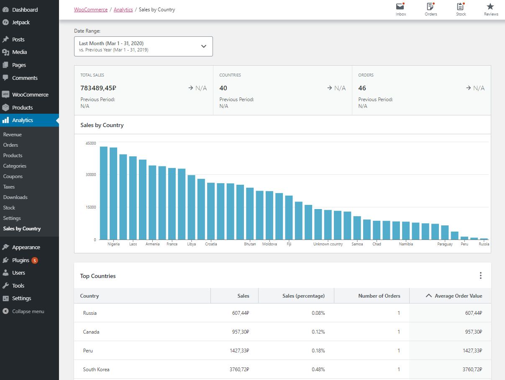

If you got stuck following along this tutorial, or if you're only interested in looking at the end result, check out the [full source code](https://github.com/gorohoroh/gorohoroh-wordpress-plugins/tree/master/wc-admin-sales-by-country) of this extension.